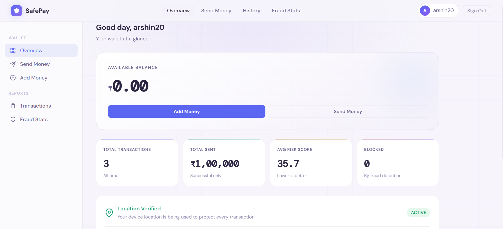
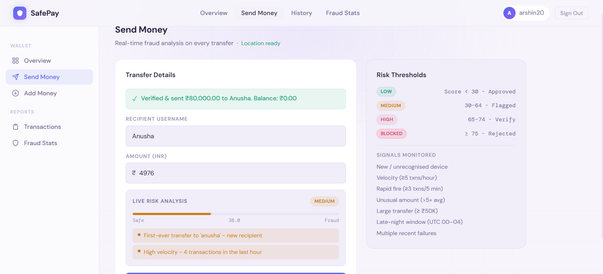
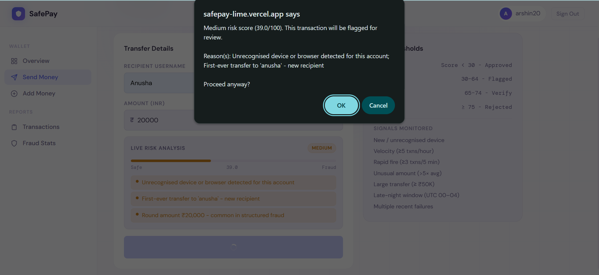
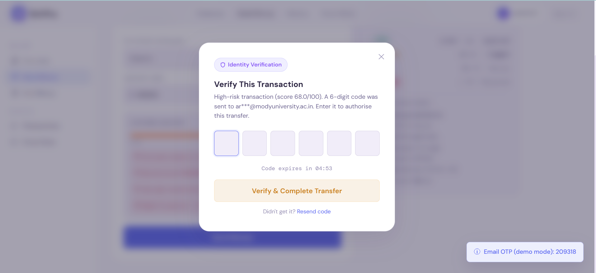
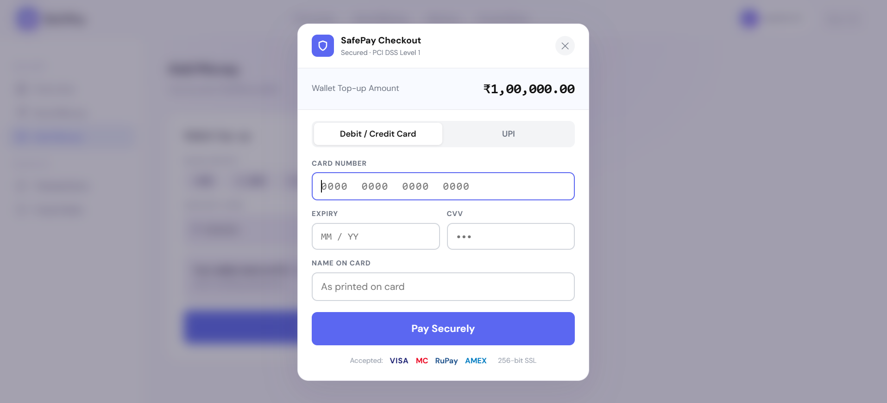
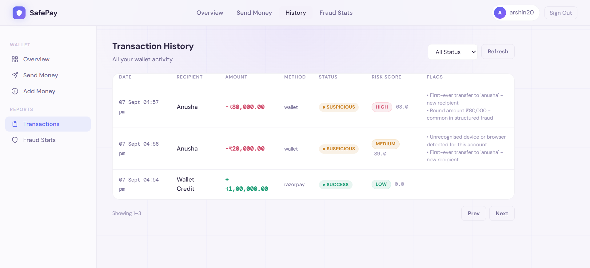
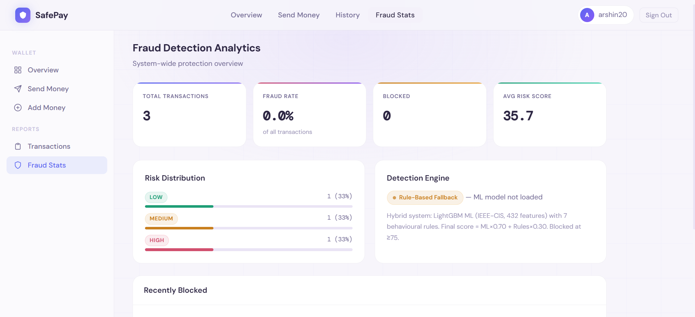

# SafePay - Fraud-Protected Payments

> A full-stack fintech simulator with JWT authentication, wallet payments, behavioural fraud detection, OTP verification, and transaction analytics.

<p align="center">
  <a href="https://safepay-lime.vercel.app">Live Demo</a>
  &nbsp; • &nbsp;
  <a href="https://safepay-hzxh.onrender.com/health">API Health</a>
</p>

> Want to deploy your own copy? See [DEPLOYMENT.md](./DEPLOYMENT.md).

---

## What is SafePay?

SafePay is a payment application where **every wallet transfer is evaluated for fraud before completion**.

The fraud engine combines behavioural and transaction signals such as:

- New devices & recipients
- Unusual transaction amounts
- Rapid transaction activity
- Failed attempts
- Location anomalies
- Late-night activity
- Dormant accounts

These signals produce a **0-100 risk score** that determines whether a transaction is approved, requires OTP verification, or is blocked.

> Portfolio/demo application - not intended for real financial transactions.

---

## Features

- JWT authentication + PBKDF2-SHA256 password hashing
- Wallet top-ups and peer-to-peer transfers
- Rule-based behavioural fraud detection
- OTP step-up verification for high-risk transfers
- Transaction history & fraud analytics
- Razorpay integration with demo payment mode
- Rate limiting, CORS, security headers & audit logging

---

## Fraud Detection

```text
Transaction
     ↓
Behavioural Signals
     ↓
Risk Score (0–100)
     ↓
┌──────────┬──────────┬──────────┐
│   LOW    │  MEDIUM  │   HIGH   │
│  < 30    │  30–54   │  55–74   │
│ APPROVE  │  FLAG    │   OTP    │
└──────────┴──────────┴──────────┘
     ↓
75+ → BLOCK
```

The current implementation is rule-based and deterministic by design - see Future Improvements for the ML roadmap.

## Architecture

``` text
  Frontend (Vercel)
        │
        │ REST API
        ▼
Flask Backend (Render)
        │
┌───────┼───────────┐
▼       ▼           ▼
Auth  Payments   Fraud Engine
│       │           │
└───────┴───────────┘
        ▼
      SQLite
```

## Tech Stack

Frontend: HTML, CSS, JavaScript
Backend: Python, Flask, Gunicorn
Database: SQLite
Auth: JWT, PBKDF2-SHA256
Payments: Razorpay
Deployment: Vercel + Render

## Screenshots

| | |
|---|---|
| **Login** <br>  | **Dashboard** <br>  |
| **Send Money** <br>  | **Medium-Risk Warning** <br>  |
| **OTP Verification (High Risk)** <br>  | **Add Money to Wallet** <br>  |
| **Transaction History** <br>  | **Fraud Stats Dashboard** <br>  |


## Run Locally

Backend
```bash
cd backend
pip install -r requirements.txt
python app.py
```

Frontend
Open frontend/index.html in a browser or serve the directory with any static server.

For local development, set:
```js
window.SAFEPAY_API_URL = "http://localhost:5000";
```

## API

```
POST  /register
POST  /login
GET   /me
GET   /balance
POST  /create-order
POST  /verify-payment
POST  /transfer
POST  /fraud-check
POST  /send-otp
POST  /verify-otp
GET   /transactions
GET   /stats
GET   /fraud-stats
GET   /health
```

## Security

PBKDF2-SHA256 password hashing with random salts
JWT-protected API routes
Parameterized SQL queries
Rate limiting
CORS restrictions
Security response headers
Backend-only payment secrets
Audit logging

## Limitations

SafePay is a portfolio/demo project, not production financial infrastructure.
The current version uses SQLite and in-memory rate limiting/OTP storage. Production infrastructure such as PostgreSQL and Redis would be used for a larger deployment.

## Future Improvements

PostgreSQL for production persistence
Redis for rate limiting and OTP storage
Automated tests + CI/CD
ML-assisted fraud scoring
Stronger MFA and account security

## Author

Arshin Kazi
Full-stack software engineering project exploring fintech systems, API development, authentication, and fraud detection.
